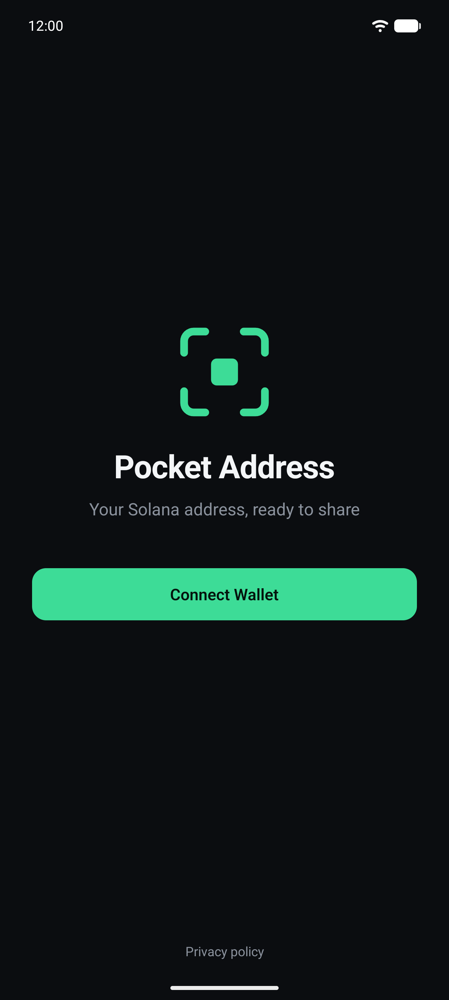
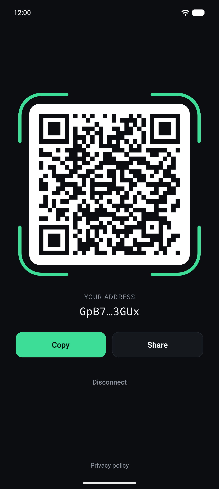
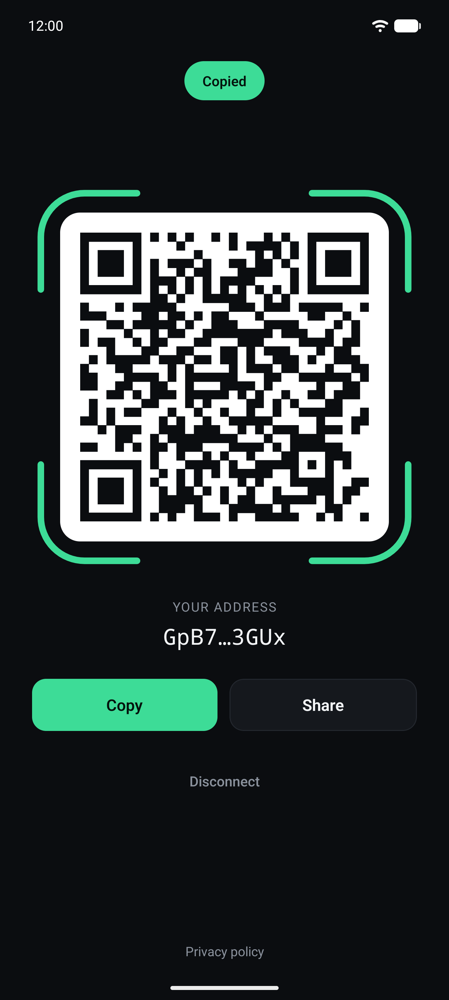
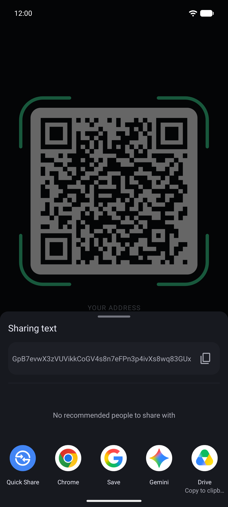

# Pocket Address

Connect a wallet with Mobile Wallet Adapter and show its public key as a large QR code, so someone else can scan it to pay you.

<p>
  <a href="docs/screenshots/1-welcome.png"></a>
  <a href="docs/screenshots/2-qr-code.png"></a>
  <a href="docs/screenshots/3-copied.png"></a>
  <a href="docs/screenshots/4-share.png"></a>
</p>

## Development

```bash
npm install
npm run android
```

Checks: `npx tsc --noEmit`, `npm run lint:check`, `npm test`.

## Building the release APK

The dApp Store rejects debug-signed APKs. The release build is signed with a release key that lives outside this repo. Its credentials are read from `~/.gradle/gradle.properties` or from environment variables with the same names:

| Name                                   | Value                                |
| -------------------------------------- | ------------------------------------ |
| `POCKET_ADDRESS_UPLOAD_KEY_ALIAS`      | Key alias inside the keystore        |
| `POCKET_ADDRESS_UPLOAD_KEY_PASSWORD`   | Key password                         |
| `POCKET_ADDRESS_UPLOAD_STORE_FILE`     | Absolute path to the `.jks` keystore |
| `POCKET_ADDRESS_UPLOAD_STORE_PASSWORD` | Keystore password                    |

The signing config is added to `android/app/build.gradle` by the config plugin in [`plugins/with-release-signing.js`](plugins/with-release-signing.js), so it survives `expo prebuild --clean`. If the credentials are missing, the release build fails instead of falling back to the debug key.

### 1. Create a keystore (first time only)

Skip this if you already have the keystore. Every update to the app must be signed with the **same** key, so back it up somewhere safe.

```bash
keytool -genkeypair -storetype PKCS12 -keystore ~/.android/keystores/pocket-address-release.jks -alias pocket-address -keyalg RSA -keysize 4096 -validity 10000
```

Then add the four properties above to `~/.gradle/gradle.properties` and run `chmod 600 ~/.gradle/gradle.properties`.

### 2. Build

```bash
npm run android:release
```

This runs `npx expo prebuild -p android --clean` followed by `./gradlew assembleRelease`. The APK is written to `android/app/build/outputs/apk/release/app-release.apk`. Only `arm64-v8a` is built (see [`plugins/with-arm64-only.js`](plugins/with-arm64-only.js)), which covers Seeker and Apple silicon emulators.

### 3. Verify the signature

```bash
$ANDROID_HOME/build-tools/<version>/apksigner verify --print-certs android/app/build/outputs/apk/release/app-release.apk
```

The signer should be `CN=beeman, OU=Pocket Address, O=beeman, C=NL`, not `CN=Android Debug`.

### 4. Install

```bash
adb install -r android/app/build/outputs/apk/release/app-release.apk
```

## Branding

The SVG sources and exported PNGs are in [`assets/branding/`](assets/branding). After editing an SVG, run `assets/branding/export.sh` (needs `rsvg-convert`, from `brew install librsvg`) to re-export the PNGs.

## Website

The website, privacy policy and terms of service live in [`docs/`](docs) and are served by GitHub Pages at https://beeman.github.io/pocket-address/. The store screenshots are in [`docs/screenshots/`](docs/screenshots).
